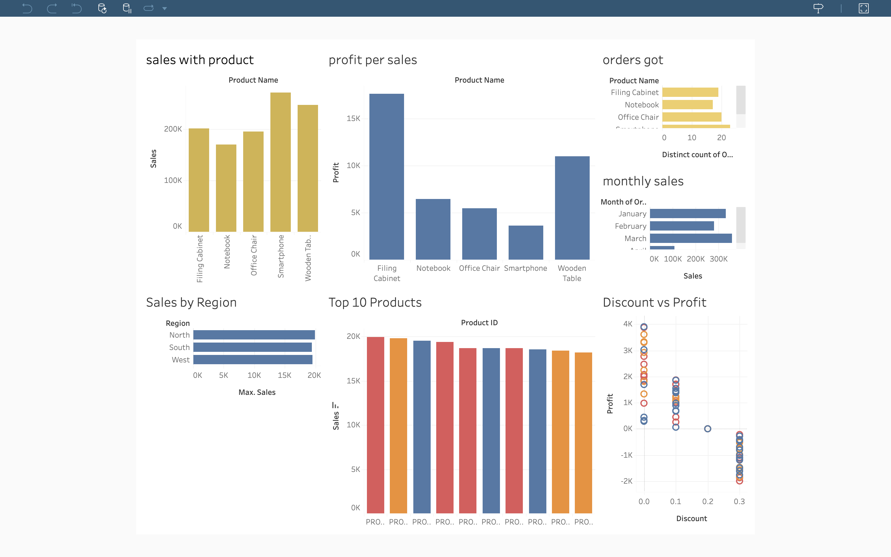

# Sales Performance & Profitability Analysis

## Project Overview
This project analyzes sales data to identify trends, top-performing products,
regional performance, and the impact of discounts on profitability.

## Tools & Technologies
- SQL (PostgreSQL)
- Tableau Public
- CSV

## Business Questions
- How do sales trends change over time?
- Which regions and products generate the most revenue?
- How do discounts impact profitability?

## Tableau Dashboard
🔗 Live Dashboard:
[https://prod-in-a.online.tableau.com/#/site/khajashaik2992786-e570fa9985/views/salesandprofits/Dashboard1?:iid=2]

## SQL Queries
All SQL queries used for this analysis are available here:
- sql/sales_analysis.sql

## Key Insights
- Sales show an overall upward trend with seasonal variations
- Top 10 products contribute a large portion of revenue
- Higher discounts are associated with lower or negative profits
